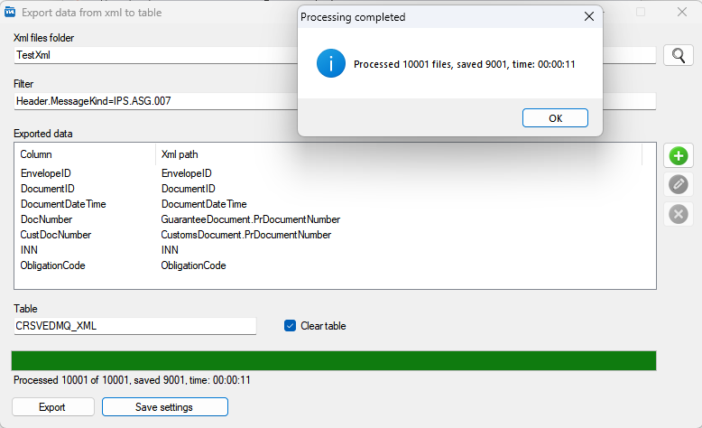

An application that scans a folder with xml files, finds matching files and saves selected data from the files into a table in the database

## Usage

Unpack the application [distribution](https://github.com/miptleha/ParseXml/releases/latest) into some folder.  
In the ParseXml.exe.config configuration file, set up the connection string for the Oracle database.  
Create a test table using the script from the [scripts](scripts) folder.  
In the TestXml folder, run the powershell script that duplicates the usage.xml file 10000 times.  
Run the ParseXml.exe application and start the xml processing.  
As a result, part of the file contents will be exported into the previously created table.

## Building the application

The application is written in .NET Framework Windows Forms 4.0.  
It was built in Visual Studio 2019.

## Switching the database

An Oracle database is used, but the application can be adapted to any database.  
To do this, add a library for working with the desired database to References (Oracle.ManagedDataAccess is used).  
In the Db folder, implement your own implementation of the IDbExecuter interface and plug it in Forms/Main.cs instead of DbExecuter.

## Filter and Path in xml

For the Filter, parentheses, the and and or operators are allowed, as well as references to an attribute (@) and specifying the element location, for example:  
Header.MessageKind=IPS.ASG.007 - inside the Header tag at any nesting level, find the MessageKind tag and make sure its value equals IPS.ASG.007

There is an editable list of exported fields in the form of a two-column table.  
The first column is the column name in the table (the table must be created and the column must exist).  
The second column is the path to search for the value in xml that will be saved into the column (it can be a tag, an attribute (put @ before the name), parent elements can be specified), for example:  
CustomsDocument.PrDocumentNumber - inside the CustomsDocument tag at any nesting level, find the PrDocumentNumber tag and extract its text value

Namespaces inside xml are ignored

